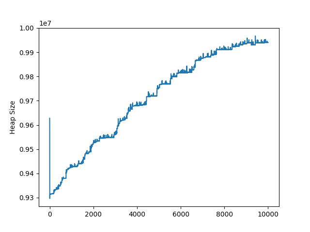
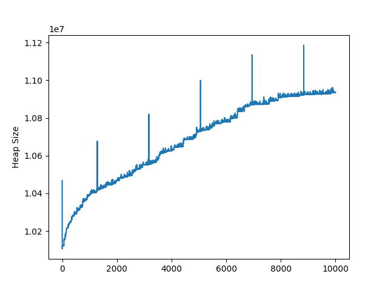
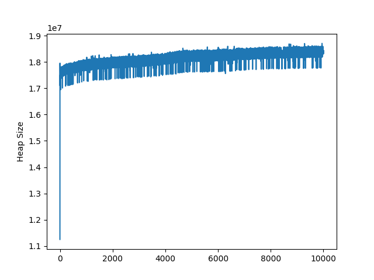

# Reproduce react-apollo memory leak

To reproduce https://github.com/apollographql/react-apollo/issues/2126 .

## Summary

### 1. Not using getDataFromTree


### 2. Light query


### 3. Large query


## How to measure heap size

### Install and build apps

```sh
$ yarn --pure-lockfile
$ yarn build
```

### Draw heap size graph

First, start GraphQL server process:

```sh
$ yarn start-gql
```

Second, start SSR server process, which is the target to monitor:

```sh
$ yarn start-ssr
```

Next benchmark via ab command:

```sh
$ ab -n 1000 http://localhost:4010
```

After shutdown the SSR server process, `heap.json` will be generated.

Finally, plot a heap size graph via the following:

```sh
$ ./plot.py
```

### Dump heap snapshot

Send `SIGUSR1` to the SSR server process.
